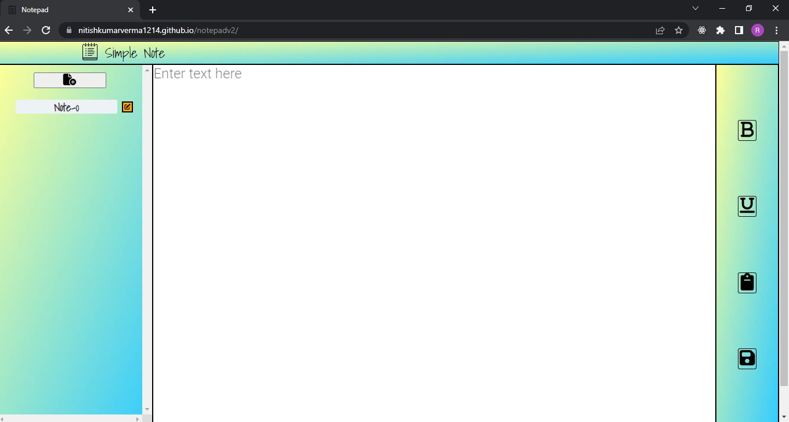

# Notepad editor

A tool that allows you to write and and format your content by making it bold and underline.

## Key Features

- Bold the selected text.
- Underline the selected text.
- copy the content with just one click.
- save the notes.
- create multiple notes and navigate between them.
- Auto save the notes when you navigate between notes.
- Fully responsive ui and can be used on mobile devices as well.

## Application Live at:
[notepad-app](https://nitishkumarverma1214.github.io/notepadv2/)

## Screenshots

